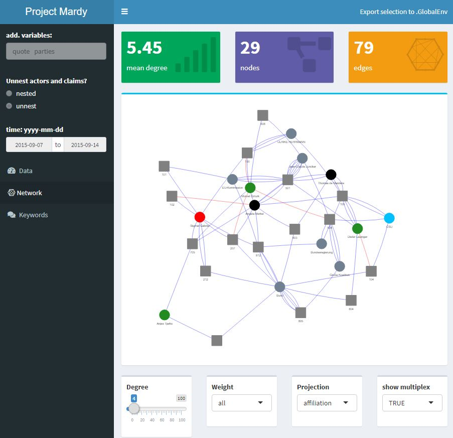

<!-- README.md is generated from README.Rmd. Please edit that file -->

# mardyr2

<!-- badges: start -->

<!-- badges: end -->

mardyr2 enables the user to select, visualize and download data from the
MARDY-research project. Additional functionalities include access to
training models via an API, the `DEbateNet-mig15`-data set, and utility
functions.

This software is part of the following publications:

> Lapesa, G., Blessing, A., Blokker, N., Dayanik, E., Haunss, S., Kuhn, J., & Padó, S. (2020).
> DEbateNet-mig15: Tracing the 2015 immigration debate in Germany over time.
> Proceedings of LREC, 919–927. https://www.aclweb.org/anthology/2020.lrec-1.115

> Blokker, N., Blessing, A., Dayanik, E., Kuhn, J., Padó, S., & Lapesa, G. (2023).
> Between welcome culture and border fence. A dataset on the European refugee crisis in German newspaper reports.
> Language Resources and Evaluation, 121 - 153. https://link.springer.com/article/10.1007/s10579-023-09641-8

## License

See [here](https://clarin09.ims.uni-stuttgart.de/debatenet/) for further
information regarding the licensing.

## Installation

You can find the LREC release version of mardyr2
[here](https://clarin09.ims.uni-stuttgart.de/debatenet/). To install the
development version please run:

``` r
devtools::install_github("nicoblokker/mardyr2")
```

## Examples

Load and access the DEbateNet-15mig data set:

``` r
library(mardyr2)
data("DEbateNet_mig15")
dim(DEbateNet_mig15)
#> [1] 1815    5
```

Start `shinydashboard` to visualize the `DEbateNet-mig15` data set

``` r
library(mardyr2)
get_data(source = "LRE")
```



Or send a test sentence to the API [**deprecated**]:

``` r
library(mardyr2)
get_predictions("Angela Merkel lehnt eine Obergrenze ab.", output = "word")
#> # A tibble: 7 x 4
#>   sentence    id prediction word      
#>      <int> <int> <chr>      <chr>     
#> 1        1     1 B-Claim    Angela    
#> 2        1     2 I-Claim    Merkel    
#> 3        1     3 I-Claim    lehnt     
#> 4        1     4 I-Claim    eine      
#> 5        1     5 I-Claim    Obergrenze
#> 6        1     6 I-Claim    ab        
#> 7        1     7 I-Claim    .
```

Access the documentation for further examples (`help(package =
"mardyr2")`).
